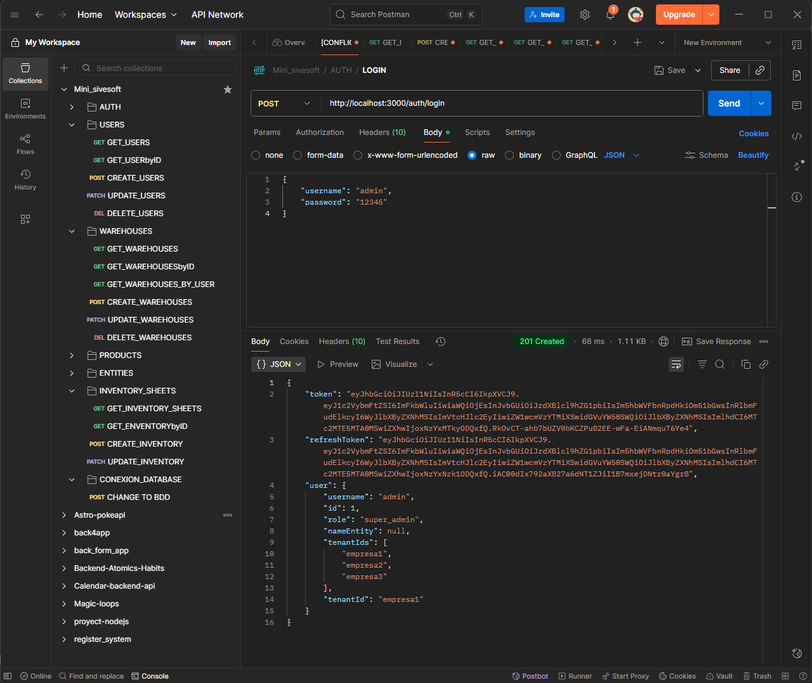

# 🏢 Mini Sivesoft Backend

<p align="center">
  
</p>

<p align="center">
  Sistema de gestión de inventario multi-tenant con NestJS, TypeORM y MySQL
</p>

<p align="center">
  
  
  
  
</p>

---

## 📋 Tabla de Contenidos

- [Descripción](#-descripción)
- [Arquitectura Multi-Tenant](#-arquitectura-multi-tenant)
- [Características Principales](#-características-principales)
- [Tecnologías](#-tecnologías)
- [Instalación Rápida](#-instalación-rápida)
- [API Endpoints](#-api-endpoints)
- [Ejemplos con Postman](#-ejemplos-con-postman)
- [Guías Adicionales](#-guías-adicionales)
- [Docker](#-docker)

---

## 📖 Descripción

**Mini Sivesoft Backend** es una API RESTful robusta diseñada para la gestión integral de inventarios en entornos multi-empresa. Permite administrar usuarios, entidades de negocio, almacenes, productos y hojas de inventario, todo bajo una arquitectura multi-tenant que garantiza aislamiento y seguridad de datos entre diferentes empresas.

### 🎯 ¿Para quién es este proyecto?

- 🏭 **Empresas con múltiples sucursales** que necesitan gestionar inventario de forma centralizada
- 📦 **Proveedores de servicios** que administran inventarios para múltiples clientes
- 🔄 **Sistemas B2B** que requieren aislamiento de datos por cliente

---

## 🏢 Arquitectura Multi-Tenant

Este proyecto implementa una **arquitectura multi-tenant a nivel de base de datos**, donde cada empresa (tenant) tiene su propia base de datos independiente.

### 🔑 Conceptos Clave:

| Concepto | Descripción |
|----------|-------------|
| **Tenant** | Una empresa u organización (empresa1, empresa2, empresa3) |
| **TenantId** | Identificador único extraído del JWT del usuario |
| **Conexión Dinámica** | Se establece en cada petición según el tenant del usuario |
| **Aislamiento Total** | Los datos de cada empresa están completamente separados |

### 🌐 Flujo de Autenticación:

```
1. Usuario hace login → 2. JWT contiene tenantId → 3. Cada request usa ese tenantId
4. Se establece conexión a BD específica → 5. Query solo en esa BD
```

📚 **Guía completa:** [MULTI_TENANT_GUIDE.md](./MULTI_TENANT_GUIDE.md)

---

## ✨ Características Principales

### 🔐 Autenticación y Autorización
- ✅ JWT con refresh tokens
- ✅ Roles de usuario: `super_admin`, `admin`, `manager`, `user`
- ✅ Guards de autenticación y autorización por rol
- ✅ Cambio dinámico de empresa (switch tenant)

### 👥 Gestión de Usuarios
- ✅ CRUD completo de usuarios
- ✅ Asignación de múltiples empresas por usuario
- ✅ Relación con entidades de negocio
- ✅ Asignación de almacenes específicos
- ✅ Filtrado por roles (no muestra super_admin ni admin)

### 🏪 Gestión de Entidades de Negocio
- ✅ CRUD de entidades (clientes/proveedores)
- ✅ Validación de documentos únicos
- ✅ Filtro de entidades disponibles (sin usuario asignado)
- ✅ Búsqueda por nombre, documento o teléfono

### 📦 Gestión de Almacenes
- ✅ CRUD de almacenes
- ✅ Relación con entidades propietarias
- ✅ Estados activos/inactivos
- ✅ Numeración de serie automática

### 🛍️ Gestión de Productos
- ✅ CRUD de productos con validaciones
- ✅ Código de barras único
- ✅ Múltiples unidades de medida (UNIDADES, CAJAS, PAQUETES, LITROS, KILOGRAMOS)
- ✅ Búsqueda por nombre o código de barras
- ✅ Restricción única por nombre + unidad

### 📊 Hojas de Inventario
- ✅ Creación y gestión de inventarios
- ✅ Estados: PENDIENTE, APROBADO, RECHAZADO
- ✅ Detalles de inventario con cantidades
- ✅ Eliminación en cascada

---

## 🛠 Tecnologías

| Tecnología | Versión | Uso |
|-----------|---------|-----|
| **NestJS** | 11.x | Framework backend |
| **TypeScript** | 5.x | Lenguaje de programación |
| **TypeORM** | 0.3.x | ORM para gestión de BD |
| **MySQL** | 8.0 | Base de datos |
| **Docker** | Latest | Contenedor de MySQL |
| **JWT** | - | Autenticación |
| **Bcrypt** | - | Encriptación de contraseñas |
| **Class Validator** | - | Validación de DTOs |
| **Swagger** | - | Documentación API |

---

## 🚀 Instalación Rápida

### Prerrequisitos

- Node.js 18+ y npm
- Docker Desktop (para MySQL)
- Git

### Pasos de Instalación

```bash
# 1. Clonar el repositorio
git clone <URL_DEL_REPOSITORIO>
cd mini_sivesoft_backend

# 2. Instalar dependencias
npm install

# 3. Configurar variables de entorno
# Crea un archivo .env en la raíz con:
NODE_ENV=development
JWT_SECRET=tu_jwt_secret_muy_seguro_aqui
JWT_REFRESH_SECRET=tu_refresh_secret_muy_seguro_aqui
DB_PORT=3309

# 4. Levantar MySQL con Docker
docker-compose up -d

# 5. Crear las bases de datos
# Espera 30 segundos para que MySQL esté listo
Get-Content .\create-databases.sql | docker exec -i mini_sivesoft_backend mysql -u root -p12345

# 6. Iniciar el servidor
npm run start:dev
```

### ✅ Verificar Instalación

```bash
# El servidor debería estar corriendo en:
http://localhost:3000

# Swagger API Documentation:
http://localhost:3000/api
```

📚 **Guía de instalación completa:** [INSTALLATION_GUIDE.md](./INSTALLATION_GUIDE.md)

---

## 🔌 API Endpoints

### 🔐 Autenticación (`/auth`)

| Método | Endpoint | Descripción | Auth |
|--------|----------|-------------|------|
| POST | `/auth/login` | Iniciar sesión | No |
| POST | `/auth/refresh` | Renovar token | No |
| POST | `/auth/switch-tenant` | Cambiar de empresa | Sí |

### 👥 Usuarios (`/users`)

| Método | Endpoint | Descripción | Roles |
|--------|----------|-------------|-------|
| GET | `/users` | Listar usuarios (excluye super_admin y admin) | Todos |
| GET | `/users/:id` | Obtener usuario por ID | ADMIN, MANAGER |
| POST | `/users` | Crear nuevo usuario | ADMIN, MANAGER, SUPER_ADMIN |
| PATCH | `/users/:id` | Actualizar usuario | ADMIN, MANAGER |
| DELETE | `/users/:id` | Eliminar usuario | ADMIN, MANAGER |

### 🏪 Entidades (`/entities`)

| Método | Endpoint | Descripción | Auth |
|--------|----------|-------------|------|
| GET | `/entities` | Listar todas las entidades | Sí |
| GET | `/entities?onlyUnassigned=true` | Solo entidades sin usuario asignado | Sí |
| GET | `/entities/:id` | Obtener entidad por ID | Sí |
| POST | `/entities` | Crear nueva entidad | Sí |
| PATCH | `/entities/:id` | Actualizar entidad | Sí |
| DELETE | `/entities/:id` | Eliminar entidad | Sí |

### 📦 Almacenes (`/warehouses`)

| Método | Endpoint | Descripción | Roles |
|--------|----------|-------------|-------|
| GET | `/warehouses` | Listar almacenes | Todos |
| GET | `/warehouses/:id` | Obtener almacén por ID | ADMIN, MANAGER |
| POST | `/warehouses` | Crear nuevo almacén | ADMIN, MANAGER |
| PATCH | `/warehouses/:id` | Actualizar almacén | ADMIN, MANAGER |
| DELETE | `/warehouses/:id` | Eliminar almacén | ADMIN, MANAGER |

### 🛍️ Productos (`/products`)

| Método | Endpoint | Descripción | Roles |
|--------|----------|-------------|-------|
| GET | `/products` | Listar productos | Todos |
| GET | `/products/barcode?code=xxx` | Buscar por código de barras | Todos |
| GET | `/products/:id` | Obtener producto por ID | Todos |
| POST | `/products` | Crear nuevo producto | ADMIN, MANAGER |
| PATCH | `/products/:id` | Actualizar producto | ADMIN, MANAGER |
| DELETE | `/products/:id` | Eliminar producto | ADMIN, MANAGER |

### 📊 Hojas de Inventario (`/inventory-sheets`)

| Método | Endpoint | Descripción | Roles |
|--------|----------|-------------|-------|
| GET | `/inventory-sheets` | Listar hojas de inventario | Todos |
| GET | `/inventory-sheets/:id` | Obtener hoja por ID | Todos |
| POST | `/inventory-sheets` | Crear nueva hoja | ADMIN, MANAGER |
| PATCH | `/inventory-sheets/:id` | Actualizar hoja | ADMIN, MANAGER |
| DELETE | `/inventory-sheets/:id` | Eliminar hoja (cascade) | ADMIN, MANAGER |

---

## 📸 Ejemplos con Postman

### Vista General de los Endpoints



### 1. Login y Obtener Token

**Endpoint:** `POST /auth/login`

```json
{
  "username": "admin",
  "password": "12345"
}
```

**Respuesta:**
```json
{
  "token": "eyJhbGciOiJIUzI1NiIsInR5cCI6IkpXVCJ9...",
  "refreshToken": "eyJhbGciOiJIUzI1NiIsInR5cCI6IkpXVCJ9...",
  "user": {
    "id": 1,
    "username": "admin",
    "role": "super_admin",
    "tenantId": "empresa1",
    "tenantIds": ["empresa1", "empresa2", "empresa3"]
  }
}
```

### 2. Cambiar de Empresa

**Endpoint:** `POST /auth/switch-tenant`

**Headers:**
```
Authorization: Bearer <TOKEN>
```

**Body:**
```json
{
  "tenantId": "empresa3"
}
```

### 3. Crear Usuario

**Endpoint:** `POST /users`

**Body:**
```json
{
  "username": "usuario_test",
  "password": "123456",
  "role": "user",
  "tenantIds": ["empresa1"],
  "entityRelationId": 1,
  "warehouseIds": [1, 2]
}
```

### 4. Listar Entidades Disponibles

**Endpoint:** `GET /entities?onlyUnassigned=true&page=1&limit=10`

Solo retorna entidades que NO están asignadas a ningún usuario.

### 5. Buscar Producto por Código de Barras

**Endpoint:** `GET /products/barcode?code=7501234567890`

### 6. Crear Hoja de Inventario

**Endpoint:** `POST /inventory-sheets`

```json
{
  "warehouseId": 1,
  "status": "PENDIENTE",
  "details": [
    {
      "productId": 1,
      "quantity": 100
    },
    {
      "productId": 2,
      "quantity": 50
    }
  ]
}
```

---

## 📚 Guías Adicionales

| Guía | Descripción |
|------|-------------|
| [INSTALLATION_GUIDE.md](./INSTALLATION_GUIDE.md) | Instalación completa paso a paso desde cero |
| [MULTI_TENANT_GUIDE.md](./MULTI_TENANT_GUIDE.md) | Arquitectura y funcionamiento multi-tenant |
| [CHANGELOG_MULTI_TENANT.md](./CHANGELOG_MULTI_TENANT.md) | Historial de cambios del proyecto |

---

## 🐳 Docker

### ¿Por qué Docker?

Docker permite levantar MySQL sin instalarlo en tu sistema, facilitando la configuración y evitando conflictos.

### Archivo `docker-compose.yml`

```yaml
version: '3.8'

services:
  mysql:
    image: mysql:8
    container_name: mini_sivesoft_backend
    ports:
      - "3309:3306"
    environment:
      MYSQL_ROOT_PASSWORD: 12345
    volumes:
      - mysql_data:/var/lib/mysql
    networks:
      - app-network

volumes:
  mysql_data:

networks:
  app-network:
    driver: bridge
```

### Comandos Útiles

```bash
# Levantar contenedor
docker-compose up -d

# Ver logs
docker logs mini_sivesoft_backend

# Detener contenedor
docker-compose down

# Eliminar contenedor y datos
docker-compose down -v

# Conectarse a MySQL
docker exec -it mini_sivesoft_backend mysql -u root -p12345
```

### Recomendaciones para Git

✅ **Incluir en el repositorio:**
- ✅ `docker-compose.yml`
- ✅ `.dockerignore`
- ✅ Scripts SQL de inicialización

❌ **NO incluir:**
- ❌ Volúmenes de datos de Docker
- ❌ Carpeta `.docker/`
- ❌ Imágenes construidas

**Agregar a `.gitignore`:**
```gitignore
# Docker
.docker/
docker-volumes/
*.sql.backup
```

---

## 🔧 Scripts Disponibles

```bash
# Desarrollo
npm run start:dev          # Inicia en modo desarrollo con hot-reload

# Producción
npm run build              # Compila el proyecto
npm run start:prod         # Inicia en modo producción

# Testing
npm run test               # Ejecuta tests unitarios
npm run test:watch         # Tests en modo watch
npm run test:cov           # Tests con coverage
npm run test:e2e           # Tests end-to-end

# Linting y Formato
npm run lint               # Ejecuta ESLint
npm run format             # Formatea código con Prettier
```

---

## 🔐 Credenciales por Defecto

Después de ejecutar `create-databases.sql`:

| Usuario | Contraseña | Rol | Empresas |
|---------|------------|-----|----------|
| `admin` | `12345` | super_admin | empresa1, empresa2, empresa3 |

⚠️ **Importante:** Cambia estas credenciales en producción.

---

## 📊 Estructura del Proyecto

```
src/
├── auth/                    # Módulo de autenticación
│   ├── decorators/         # Decoradores personalizados
│   ├── guards/             # Guards de autorización
│   ├── strategies/         # Estrategias JWT y Local
│   └── dto/                # DTOs de autenticación
├── BusinessEntity/         # Módulo de entidades de negocio
├── users/                  # Módulo de usuarios
├── warehouses/             # Módulo de almacenes
├── products/               # Módulo de productos
├── inventory-sheets/       # Módulo de hojas de inventario
└── tenant/                 # Módulo de multi-tenancy
    ├── tenant-connection.service.ts
    └── decorator/
        └── tenant-id.decorator.ts
```

---

## 🤝 Contribuir

```bash
# development
$ npm run start

# watch mode
$ npm run start:dev

# production mode
$ npm run start:prod
```

## Run tests

```bash
# unit tests
$ npm run test

# e2e tests
$ npm run test:e2e

# test coverage
$ npm run test:cov
```

## Deployment

When you're ready to deploy your NestJS application to production, there are some key steps you can take to ensure it runs as efficiently as possible. Check out the [deployment documentation](https://docs.nestjs.com/deployment) for more information.

If you are looking for a cloud-based platform to deploy your NestJS application, check out [Mau](https://mau.nestjs.com), our official platform for deploying NestJS applications on AWS. Mau makes deployment straightforward and fast, requiring just a few simple steps:

```bash
$ npm install -g @nestjs/mau
$ mau deploy
```

With Mau, you can deploy your application in just a few clicks, allowing you to focus on building features rather than managing infrastructure.

## Resources

Si deseas contribuir a este proyecto:

1. Fork el repositorio
2. Crea una rama para tu feature (`git checkout -b feature/AmazingFeature`)
3. Commit tus cambios (`git commit -m 'Add some AmazingFeature'`)
4. Push a la rama (`git push origin feature/AmazingFeature`)
5. Abre un Pull Request

---

## 📝 Notas Importantes

### Seguridad

⚠️ **En Producción:**
- Cambia los secretos JWT en `.env`
- Cambia la contraseña de MySQL
- Cambia las credenciales del usuario admin
- Usa HTTPS
- Implementa rate limiting
- Configura CORS apropiadamente

### Performance

💡 **Optimizaciones:**
- Usa paginación en todos los endpoints de listado
- Implementa caché para queries frecuentes
- Considera usar Redis para sesiones
- Optimiza queries con índices en MySQL

### Backup

🔐 **Respaldo de Datos:**
```bash
# Backup de una base de datos
docker exec mini_sivesoft_backend mysqldump -u root -p12345 mini_sivesoft_backend > backup.sql

# Restaurar backup
Get-Content .\backup.sql | docker exec -i mini_sivesoft_backend mysql -u root -p12345 mini_sivesoft_backend
```

---

## 🐛 Troubleshooting

### El servidor no inicia
- Verifica que MySQL esté corriendo: `docker ps`
- Revisa los logs: `docker logs mini_sivesoft_backend`
- Asegúrate de que el puerto 3309 no esté en uso

### Error de conexión a la base de datos
- Espera 30 segundos después de `docker-compose up`
- Verifica que las bases de datos existan: `SHOW DATABASES;`
- Revisa las variables de entorno en `.env`

### Token expirado
- El token JWT expira en 30 minutos
- Usa el refresh token para renovarlo
- Haz login nuevamente

---

## 📚 Recursos Adicionales

### NestJS
- [Documentación oficial de NestJS](https://docs.nestjs.com)
- [NestJS Courses](https://courses.nestjs.com/)
- [NestJS Discord](https://discord.gg/G7Qnnhy)

### TypeORM
- [Documentación de TypeORM](https://typeorm.io/)
- [TypeORM Migrations](https://typeorm.io/migrations)

### Docker
- [Docker Documentation](https://docs.docker.com/)
- [Docker Compose](https://docs.docker.com/compose/)


## 📄 Licencia

Este proyecto es privado y está bajo licencia propietaria.

---

## 👏 Agradecimientos

- Built with [NestJS](https://nestjs.com/)
- Powered by [TypeORM](https://typeorm.io/)
- Database: [MySQL](https://www.mysql.com/)
- Containerization: [Docker](https://www.docker.com/)

---

<p align="center">
  Hecho con ❤️ para la gestión eficiente de inventarios
</p>

<p align="center">
  <strong>Mini Sivesoft Backend</strong> - Sistema Multi-Tenant de Inventarios
</p>
